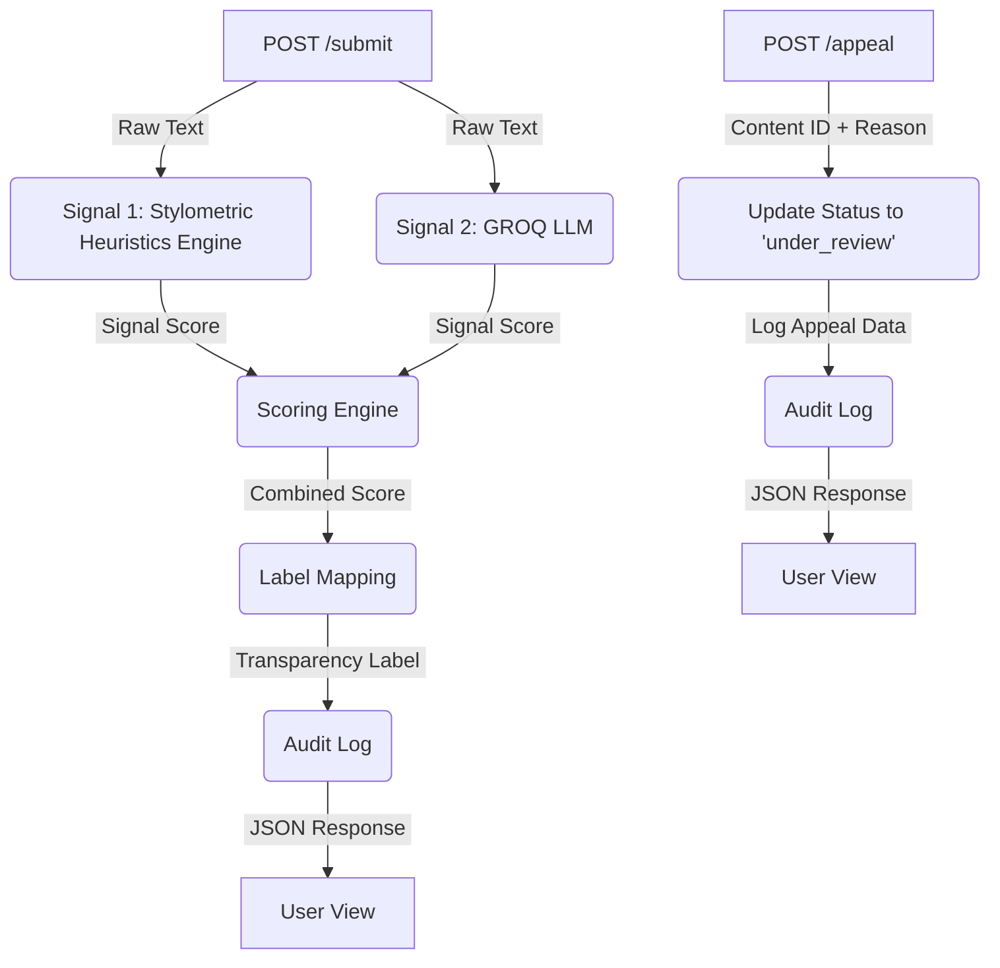

# Project Provenance Guard
### Description
---

**Provenance Guard** is a backend API designed for creative platforms (like writing communities, blogging sites, or poetry hubs) to automatically check whether submitted text is original human work or AI-generated.
Instead of being a blunt, binary filter that just blocks or allows text, it focuses on **managing uncertainty transparently** and giving creators a fair way to contest automated decisions.

### Architecture Narrative
---

A single piece of text will first be sent via a `POST /submit` request to the Flask API Gateway. Before the text is processed, the request will hit the **Defensive Layer**, which consists solely of *Flask-Limiter*. It will evaluate the request and, if it exceeds the threshold, reject it immediately and log the failure.

If cleared, the gateway will forward the entire payload to the **Multi-Signal Detection Pipeline**. Inside the pipeline, the text is parsed by two components: the **GROQ LLM Evaluator**, which analyzes the semantic style and returns an AI confidence score, and the **Stylometric Heuristic Engine**, a cheap and fast function that uses sentence length variance and vocabulary diversity to output its own confidence score.

These two scores are then passed to the **Scoring Engine**, which blends them into a final calibrated confidence percentage. This score is then passed to the **Label Mapping** function, which returns the appropriate label against defined thresholds.

Once a final transparency label is outputted alongside the submitted text, the user can submit a structured request containing the text they want to appeal, their appeal reason, and what it was originally labeled as. At each step, the system will log the final label decision, confidence score, signals used, and any appeals. These logs can be retrieved via the `GET /log` endpoint.

### Multi-Signal Detection Pipeline
---

1. **Stylometric Heuristic Engine**
* **What it measures:** Sentence length variance and vocabulary diversity (Type-Token Ratio).
* **Why it differs:** AI-generated text tends to be highly uniform and statistically consistent, leading to lower sentence length variance and less vocabulary diversity. Human writing is naturally more erratic, varied, and structurally unpredictable.
* **Blind Spots:** It completely lacks semantic understanding. It fails on highly structured, formal human writing—such as legal documentation, instruction manuals, or textbooks—which are intentionally uniform and repetitive, leading to false positives.

2. **GROQ LLM Evaluator**
* **What it measures:** Holistic semantic style, contextual coherence, and document-type patterns.
* **Why it differs:** It acts as a holistic evaluator, identifying complex, high-level structural artifacts, overused transitions, and predictable semantic pacing common to LLM outputs.
* **Blind Spots:** It struggles with precise statistical breakdowns. It cannot accurately calculate exact numerical variances on the fly and can easily be fooled by lightly edited AI content or unusually rigid, template-driven human writing.

### False Positive Problem
---
**Question**: What happens when the system misclassifies a human writer's work?

**Answer**: The confidence score will reflect that it should be near 0.5. The label for this false positive problem should be [UNCERTAIN]. The creator can then appeal by writing their reason for appealing the text and then the system will instantly mark their text with the UNDER_REVIEW status.

### API Surface
---

Endpoint | Accepts (JSON Payload) | Returns (JSON Response)
:--- | :--- | :---
`POST /submit` | `text`: string   `creator_id`: string | `content_id`: string   `attribution`: string   `confidence`: float   `label`: string
`POST /appeal` | `content_id`: string   `creator_reasoning`: string | `status`: "under_review"   `message`: string
`GET /log` | _Not Applicable_ | `entries`: array of log objects   *(Each: timestamp, content_id, scores, status, appeal)*

### Architecture Diagram
---
