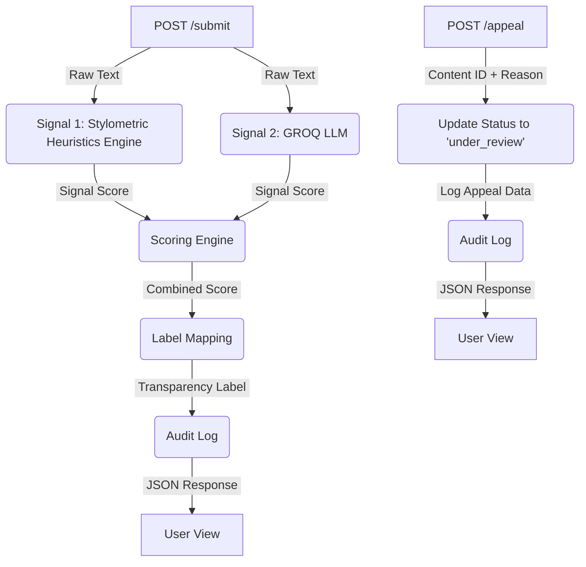

# Project Provenance Guard
### Description
---

**Provenance Guard** is a backend API designed for creative platforms (like writing communities, blogging sites, or poetry hubs) to automatically check whether submitted text is original human work or AI-generated.
Instead of being a blunt, binary filter that just blocks or allows text, it focuses on **managing uncertainty transparently** and giving creators a fair way to contest automated decisions.

&nbsp;
### Architecture Narrative
---

A single piece of text will first be sent via a `POST /submit` request to the Flask API Gateway. Before the text is processed, the request will hit the **Defensive Layer**, which consists solely of *Flask-Limiter*. It will evaluate the request and, if it exceeds the threshold, reject it immediately and log the failure.

If cleared, the gateway will forward the entire payload to the **Multi-Signal Detection Pipeline**. Inside the pipeline, the text is parsed by two components: the **GROQ LLM Evaluator**, which analyzes the semantic style and returns an AI confidence score, and the **Stylometric Heuristic Engine**, a cheap and fast function that uses sentence length variance and vocabulary diversity to output its own confidence score.

These two scores are then passed to the **Scoring Engine**, which blends them into a final calibrated confidence percentage. This score is then passed to the **Label Mapping** function, which returns the appropriate label against defined thresholds.

Once a final transparency label is outputted alongside the submitted text, the user can submit a structured request containing the text they want to appeal, their appeal reason, and what it was originally labeled as. At each step, the system will log the final label decision, confidence score, signals used, and any appeals. These logs can be retrieved via the `GET /log` endpoint.

&nbsp;
### Multi-Signal Detection Pipeline
---

1. **Stylometric Heuristic Engine**
* **What it measures:** Sentence length variance and vocabulary diversity (Type-Token Ratio).
* **Why it differs:** AI-generated text tends to be highly uniform and statistically consistent, leading to lower sentence length variance and less vocabulary diversity. Human writing is naturally more erratic, varied, and structurally unpredictable.
* **Blind Spots:** It completely lacks semantic understanding. It fails on highly structured, formal human writing—such as legal documentation, instruction manuals, or textbooks—which are intentionally uniform and repetitive, leading to false positives.
* **Output:** A confidence score between 0 - 1, calculated by the average of the sentence length variance & vocabulary diversity.

2. **GROQ LLM Evaluator**
* **What it measures:** Holistic semantic style, contextual coherence, and document-type patterns.
* **Why it differs:** It acts as a holistic evaluator, identifying complex, high-level structural artifacts, overused transitions, and predictable semantic pacing common to LLM outputs.
* **Blind Spots:** It struggles with precise statistical breakdowns. It cannot accurately calculate exact numerical variances on the fly and can easily be fooled by lightly edited AI content or unusually rigid, template-driven human writing.
* **Output:** A confidence score between 0 - 1

&nbsp;
### Scoring Engine Layer
---
* **Input:** Score from both **Stylometric Heuristic Engine** & **GROQ LLM Evaluator**.
* **Output:** The average score between both signals 
#### Formula:
$$\text{Overall Confidence Score}=\frac{\text{signal 1 score} + \text{signal 2 score}}{2}$$

&nbsp;
### False Positive Problem
---
**Question**: What happens when the system misclassifies a human writer's work?

**Answer**: The confidence score will reflect that it should be near 0.5. The label for this false positive problem should be [UNCERTAIN]. The creator can then appeal by writing their reason for appealing the text and then the system will instantly mark their text with the UNDER_REVIEW status.

&nbsp;
### Uncertainty Representation / Transparency Label Design
---
I will map raw signal outputs to a calibrated score by using a 3 threshold scoring system. 

| Score Range | Internal Status | Example Transparency Label Text |
| :--- | :--- | :--- |
| **0.7 – 1.00** | High-Confidence AI | 🤖 *Automated System Verdict:* "Highly likely to be AI-generated." |
| **0.40 – 0.7** | Uncertain / Review | ⚠️ *Uncertain:* "Mixed signals detected. This content is under review." |
| **0.00 – 0.39** | High-Confidence Human | ✍️ *Verified Style:* "Highly likely to be original human writing." |

So a confidence score of 0.6 will be labeled as Uncertain / Review.

&nbsp;
### Appeals Workflow
---
**Question: Who can submit an appeal?**

**Answer:** Only creators whose content has been flagged with an `Uncertain` or `High-Confidence AI` label can submit an appeal.

---
**Question: What information do they provide?**

**Answer:** Creators must provide a text-based statement explaining why they believe their content was misclassified and should instead be marked as `High-Confidence Human`.

---
**Question: What does the system do when an appeal is received? What status changes, and what gets logged?**

**Answer:** The system does not perform automated re-classification. Instead, it immediately flags the content status as `under_review`. Concurrently, a structured entry is appended to the audit log containing the `content_id`, the updated `under_review` status, and the creator's reasoning.

---
**Question: What would a human reviewer see when they open the appeal queue?**

**Answer:** A human reviewer will see a queue displaying the submitted text, its original system label (`Uncertain` or `High-Confidence AI`), and the justification provided by the creator.

&nbsp;
### Anticipated Edge Cases
---

1. **Minimalist Poetry:** Poems with repetitive structures or intentional refrains will have low vocabulary diversity and minimal sentence length variance. This artificially inflates the confidence score past 0.40, incorrectly triggering an `Uncertain` label.

2. **Flash Fiction / Micro-Prose:** Extremely short narratives (under 150 words) provide too small of a statistical sample for the Stylometric Engine. If the author uses a uniform, punchy sentence structure for stylistic effect, the lack of variance and low token-diversity will cause the system to flag the human content as `Uncertain` or `High-Confidence AI`.

&nbsp;
### API Surface
---

Endpoint | Accepts (JSON Payload) | Returns (JSON Response)
:--- | :--- | :---
`POST /submit` | `text`: string   `creator_id`: string | `content_id`: string   `attribution`: string   `confidence`: float   `label`: string
`POST /appeal` | `content_id`: string   `creator_reasoning`: string | `status`: "under_review"   `message`: string
`GET /log` | _Not Applicable_ | `entries`: array of log objects   *(Each: timestamp, content_id, scores, status, appeal)*

&nbsp;
### Architecture Diagram
---

**Diagram Description:** 

The system architecture handles content validation and dispute resolution through two isolated pipelines. In the submission flow, incoming text is concurrently analyzed by a stylometric heuristics engine and a Groq LLM before a central scoring engine aggregates their metrics into a user-facing transparency label and records the transaction in an audit log. Conversely, the appeal flow allows users to contest an evaluation by updating the specific item's status to `under_review` and appending content_id to the logs.

&nbsp;
## AI Tool Plan

### Milestone 3: Submission Endpoint & First Signal
* **Context Provided:** Provide the AI tool with the complete system diagram and the specific "Detection Signals" section from the spec.

* **Generation Request:** Prompt the tool to generate the core Flask application skeleton, the `POST /submit` route stub, and the pure-Python stylometric heuristics function. Additionally, request a suite of mocked text inputs (varying in vocabulary diversity and sentence structures) to independently unit-test the heuristics signal.

* **Verification Step:** Run the generated heuristics function locally against the mock data to ensure the returned structural metrics align with expectations before wiring it into the endpoint.

### Milestone 4: Second Signal & Confidence Scoring Engine
* **Context Provided:** Provide the AI tool with the system diagram, the "Detection Signals" section, and the "Uncertainty Representation" thresholds.

* **Generation Request:** Prompt the tool to generate the Groq LLM integration function, a baseline system prompt for `llama-3.3-70b-versatile` to enforce structured probability outputs, and the scoring engine logic that aggregates both signals.

* **Verification Step:** Test the combined pipeline against the 4 baseline text profiles (Clearly AI, Clearly Human, Formal Human, and Lightly Edited AI) to verify that raw metrics scale correctly and that boundary conditions cleanly resolve into the designated score buckets.

### Milestone 5: Production Layer & Appeals Workflow
* **Context Provided:** Provide the AI tool with the system diagram, the exact text string mappings for the three "Transparency Label" variants, and the "Appeals Workflow" functional specifications.

* **Generation Request:** Prompt the tool to generate the label mapping helper logic and the complete `POST /appeal` endpoint.

* **Verification Step:** Programmatically assert that all three transparency label variants are reachable based on calculated score inputs, and verify via a `curl` command that submitting an appeal correctly mutates the target item's database/log state to `under_review`.